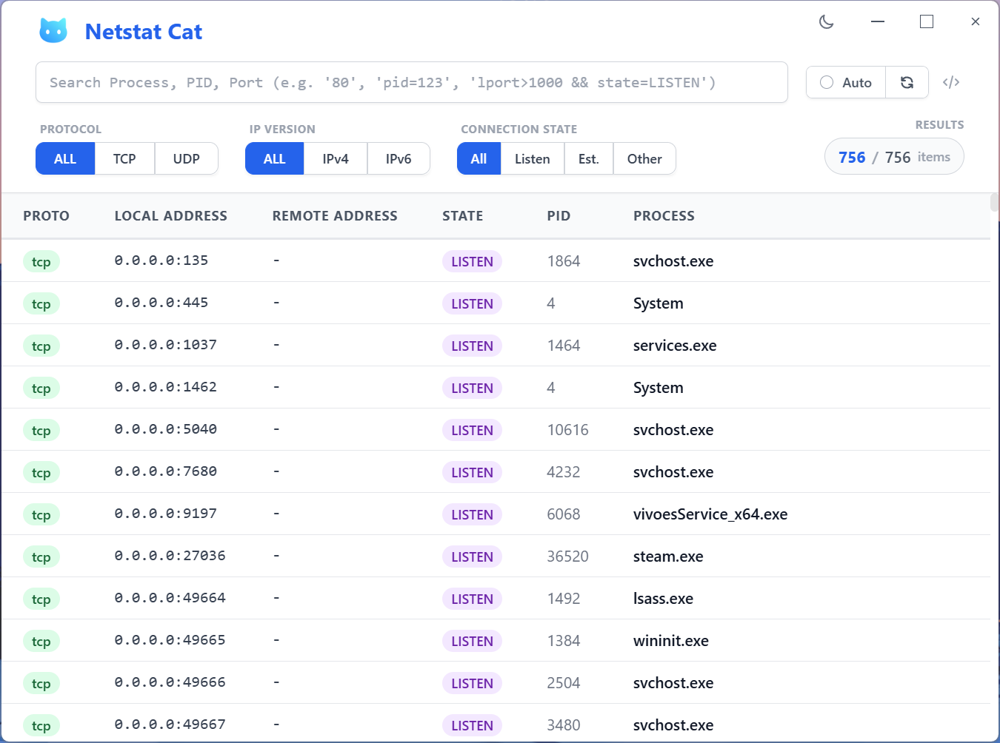
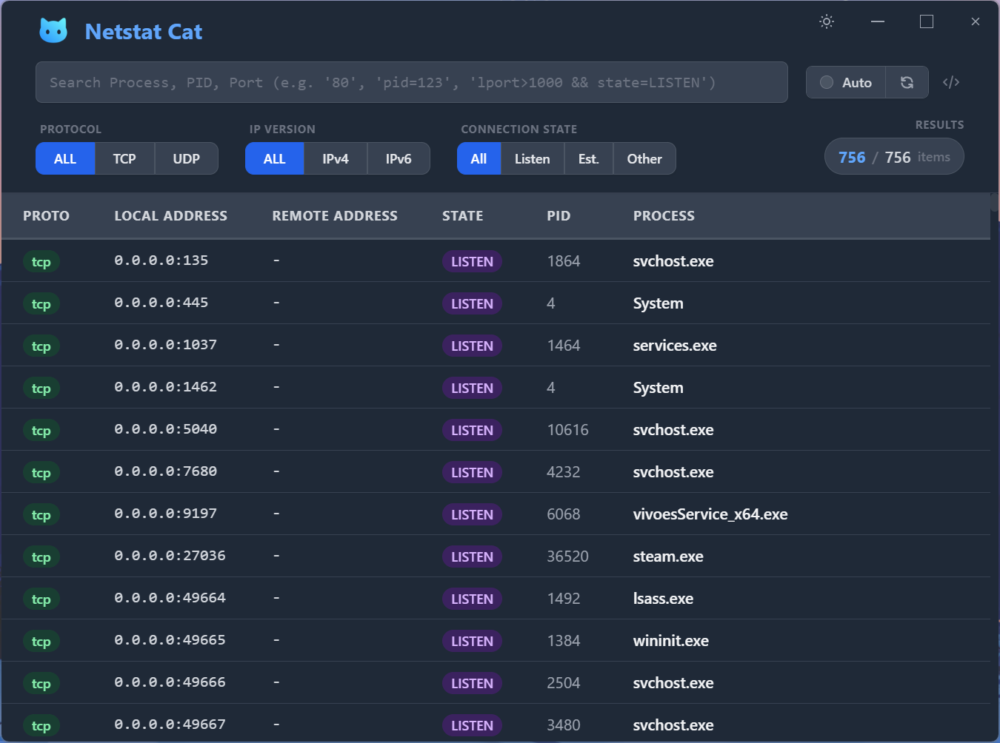
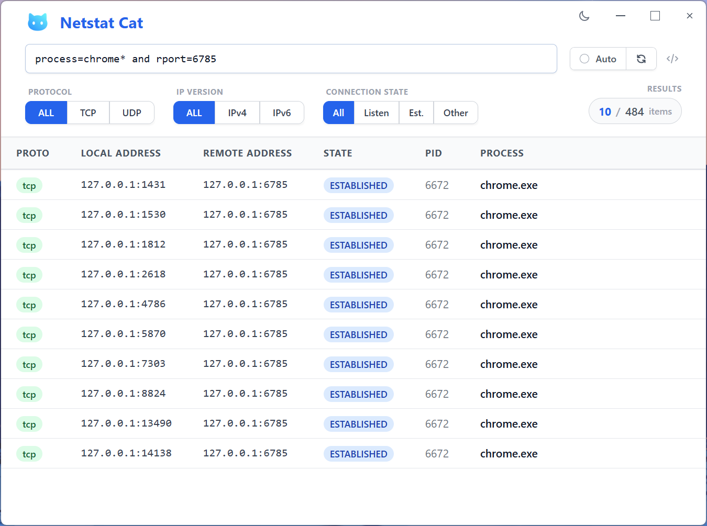
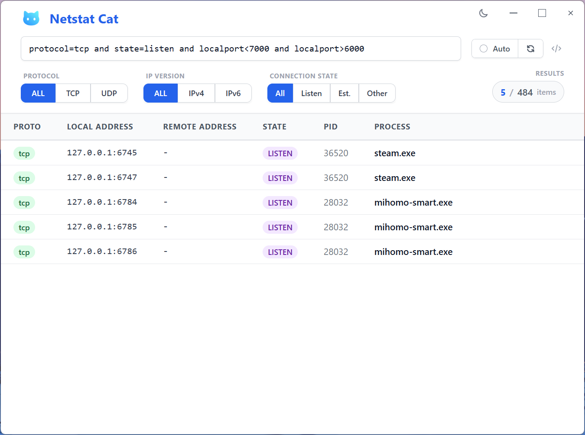

# Netstat Cat 网络监控工具

> 一款功能强大的网络监控工具，具备实时连接跟踪和高级过滤功能

<div align="center">

**[[English](README.md)]** [中文]

</div>

## 项目概述

Netstat Cat 是一款基于 **Tauri v2** 和 **Rust** 构建的轻量级桌面应用程序，为 macOS 和 Windows 系统上的网络连接监控提供了用户友好的界面。它作为命令行 `netstat` 工具的图形化替代品，让网络活动监控和应用程序端口识别变得更加简单。

## 核心功能

- **安全与隐私** - 纯本地运行，无网络连接或数据传输
- **实时网络监控** - 实时显示活跃的 TCP/UDP 连接
- **进程识别** - 显示每个网络连接所属的进程
- **高级过滤系统** - 支持按进程名、PID、端口范围或语义查询搜索，如 `process=chrome && lport>1000` [详见过滤指南](filters_cn.md)
- **虚拟化表格性能** - 使用 React Virtuoso 高效处理大量连接
- **延迟进程解析** - 仅在悬停时获取完整可执行文件路径
- **LRU 缓存** - 智能缓存进程路径，避免重复系统调用

- **现代化界面** - 无边框窗口，支持深色/浅色主题切换
- **自动刷新模式** - 可配置的实时监控（2秒间隔）

## 截图


_浅色主题界面_


_深色主题界面_


_高级查询过滤_


_连接过滤选项_

## 快速开始

### 系统要求

- macOS 10.15+ 或 Windows 10+
- Node.js 20+
- npm
- Rust（通过 [rustup](https://rustup.rs/) 安装）

### 安装步骤

```bash
# 克隆仓库
git clone https://github.com/XueshiQiao/netstat-cat.git
cd netstat-cat

# 安装依赖
npm install
```

### 开发环境

```bash
# 启动 Tauri 开发服务器（编译 Rust 后端 + 启动 Vite）
npm run tauri:dev

# 运行类型检查
npm run typecheck

# 运行代码检查
npm run lint
```

### 构建应用

```bash
# 构建当前平台
npm run tauri:build
```

## 使用指南

### 基础监控

1. 启动应用程序查看所有活跃的网络连接
2. 使用过滤按钮快速按协议、IP版本或连接状态筛选
3. 启用自动刷新进行实时监控

### 高级过滤

- **简单搜索**: 输入进程名、PID 或端口（如 `chrome`、`8080`）
- **通配符**: 使用 `*` 进行模式匹配（如 `*.exe`）
- **端口范围**: 使用范围如 `80-443`
- **语义查询**: 使用高级语法如 `process=chrome && lport>1000`

完整过滤文档请参考 [filters_cn.md](filters_cn.md)。

## 技术架构

### 前端技术栈

- **React 19** 配合 TypeScript
- **Tailwind CSS** 样式框架
- **React Virtuoso** 虚拟化滚动
- **Vite** 前端构建工具

### 后端（Rust）

- **Tauri v2** 原生桌面集成（使用系统 WebView，二进制文件约 5MB）
- **netstat2** crate 跨平台 socket 枚举
- **sysinfo** crate PID 到进程名解析
- **Tauri IPC** 前端与 Rust 后端通信

### 性能特性

- 进程路径延迟加载
- 虚拟化表格渲染
- 高效缓存策略
- 优化的系统调用

## 开发指南

### IDE 设置

推荐: [VSCode](https://code.visualstudio.com/) + [ESLint](https://marketplace.visualstudio.com/items?itemName=dbaeumer.vscode-eslint) + [Prettier](https://marketplace.visualstudio.com/items?itemName=esbenp.prettier-vscode)

### 项目结构

```
netstat-cat/
├── src/                  # React 前端
│   ├── App.tsx           # 主界面组件
│   ├── main.tsx          # 入口文件
│   ├── assets/           # CSS 和图片
│   └── utils/            # 查询解析器、进程缓存
├── src-tauri/            # Rust 后端
│   ├── src/
│   │   ├── lib.rs        # Tauri 应用配置与命令注册
│   │   ├── netstat.rs    # 网络 socket 获取逻辑
│   │   └── process_info.rs  # 数据结构
│   ├── Cargo.toml
│   └── tauri.conf.json   # Tauri 配置
├── index.html
├── vite.config.ts
└── resources/            # 图标和权限配置
```

### 脚本命令

- `npm run tauri:dev` - 启动 Tauri 开发模式
- `npm run tauri:build` - 生产构建
- `npm run typecheck` - TypeScript 类型检查
- `npm run lint` - ESLint 代码检查
- `npm run format` - Prettier 代码格式化

## 贡献指南

1. Fork 仓库
2. 创建功能分支
3. 进行更改
4. 运行测试和代码检查
5. 提交 Pull Request

## 许可证

本项目采用 GNU General Public License v3.0 许可证 - 详见 [LICENSE](LICENSE) 文件。

## 相关文档

- [过滤指南 (英文)](filters_en.md)
- [过滤指南 (中文)](filters_cn.md)
